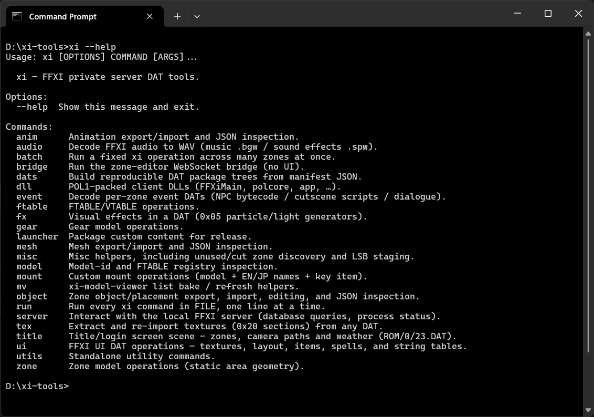

# xi-tools

CLI toolkit for FFXI DAT modding on private servers — models, animations, zones,
gear, mounts, VFX, audio, UI, events, and packaging.

> **Command reference:** see **[QUICKY.md](QUICKY.md)** for the full public CLI surface and examples.



---

## Requirements

| Requirement | Notes |
|---|---|
| **[Python 3.14](https://www.python.org/downloads/)** | Recommended runtime |
| **[uv](https://docs.astral.sh/uv/)** | Fast Python package/project manager — installs deps and runs the CLI |
| **[Blender](https://www.blender.org/download/)** | 3D mesh/animation editing and FBX support |

---

## Getting Started

1. **Clone the repo** *or* download the [latest release zip](https://github.com/vekien/xi-tools/releases)
2. Copy [`.env.sample`](.env.sample) → `.env` and fill in the paths to FFXI and Blender
3. Open a terminal in the root folder and run:

```bash
uv run xi --help
```

This installs all Python dependencies and shows the full command list.

4. Run commands with:

```bash
uv run xi <command> <arg>
```

---

## Install (optional permanent CLI)

Install once so you can type `xi` instead of `uv run xi`:

```bash
uv tool install -e .
xi --help
```

---

## Environment Variables

| Variable | Purpose |
|---|---|
| `FFXI_DIR` | FFXI game install — tools read **and** write here |
| `FFXI_HD_DIR` | HD asset-pack DAT root (publish-to-HD / HD preview) |
| `FFXI_PIVOT_DIR` | Ashita/XIPivot override DAT root (keeps F/V tables in sync) |
| `BLENDER_PATH` | Path to `blender.exe` — mesh/anim editing + FBX |
| `CUSTOM_FTABLE` | ROM name for the custom namespace (default: `ROM10`) |
| `XI_VGMSTREAM` | `vgmstream-cli` for ATRAC3 (`xi audio`); else from `PATH` |
| `XI_SERVER_DIR` | Local LSB/server checkout root (`xi zone new`, server helpers) |
| `XI_NAVMESH_DIR` | Directory of server `.nav` files |
| `XI_DB_*` | Optional MySQL settings for `xi server` |

See [`.env.sample`](.env.sample) for the full list.

---

## Features

### Animation

- Export, import, and schedule creation
- Replace existing animations on characters, NPCs, etc. (auto-detect)
- Layered animations — blend multiple animations on top of each other
- Inject brand-new animations (mounts, monsters, attack sets, etc.)
- Skeletal clips and `0x07` cutscene routines (`xi anim export` / `import` / `schedule`)

### Mesh

- Export / import including mirroring, unmirroring, split textures, multi-polygon meshes, weights/rigging
- Ideal for asymmetrical monsters (e.g. battle-worn Byakko with an eyepatch as a separate 3D model + texture)
- glTF/GLB round-trip; optional FBX via Blender
- Entity inject, recolor, look-blob decode, NPC bake helpers

### Textures

- Export / import for any graphics, UI, etc.
- DDS ↔ PNG via `xi utils` / `xi tex`
- UI texture extract/import (`sx`/`si`), layout position tweaks

### FFXIMain / FTABLE patching

- Expand model IDs, F/V table mapping, modify entries, custom ROM folders
- Patch gear IDs up to **4096**, models up to **65k**
- Lookup, range-scan, set/delete entries, reset from `.base` backups
- `xi model search` / `json` — registered modelids, free slots, DAT paths
- `xi dll` — POL1 client DLLs (`ffximain` / `polcore` / `app`): unpack, pack, gear-patch, crashdump

### Mounts

- Mount injection including keyitems, category listing, EN/JP support
- Search / export / import / delete

### Gear

- Export, import, modify; add/remove parts; edit the mesh
- Auto skeleton detection; import to new model IDs
- Simple wizard injector
- Texture edit; character assemble from `look`
- Custom gear inject (incl. particle-config bake), import-json configs

### Zones & objects

- Zone export, import, rebuilds; object/environment modifications
- Ties into **xi-zone-editor** (separate release)
- Collision mesh modifications
- Object export/import/replace/clone/delete/set-placement/swap-placement
- `xi zone new`, `make-template`, `scaffold-server`, `delete`, `footsteps`
- FX inspect/set/copy/delete/export (zone particle & light generators)

### Navmesh

- Auto navmesh building from collision (see [NavMesh Builder](#navmesh-builder) below)

### FX

- Export, import, and modifications for zone particle & light generators

### Audio

- Music + SFX export
- Search/catalog, decode/encode BGW/SPW, install into the game tree
- DAT sound-reference inspection (`xi audio refs`)

### Events & dialogue

- Event manipulation for cutscenes, dialog, custom NPCs
- Cutscene export/import; dialogue actors, search, edit, reset
- Event authoring / compile helpers under `xi event`

### Bulk actions & data

- Batch jobs (`xi batch`) — bulk zone/audio/asset work
- Data searching, JSON exports, opcode exports
- Strings, spells, item tables (general/consumable/armor/weapon/mount/custom)
- Item icons

### DAT packaging

- `xi dats prepare` / `build` / `json` / `changelog` — project manifests, locked
  allocations, standard/HD client packages, reproducible builds

### Client / server utilities

- `xi launcher ui-themes`
- `xi server` — DB queries / status when `XI_SERVER_DIR` + DB env are set
- `xi misc` — orphans, staging, scans, previews

---

## NavMesh Builder

Bake a **server-compatible** pathfinding navmesh (`.nav`) from a zone's collision
mesh via the bundled Recast/Detour library. Used by LandSandBoat / CatsEyeXI map
servers (`navmeshes/<ZoneName>.nav`).

A prebuilt `xi_navmesh.dll` ships in `src/xi/libs/`. Rebuild only if you change
the native sources.

### One-time rebuild (optional)

Needs a C++ toolchain (MSVC / clang / gcc) + CMake ≥ 3.15:

```sh
cd misc/tools/xi-navmesh
cmake -B build -DCMAKE_BUILD_TYPE=Release
cmake --build build --config Release
```

Produces `xi_navmesh.dll` (Windows) / `xi_navmesh.so` (Linux). `xi zone navmesh`
finds it under `build/`, `build/Release/`, or the bundled `src/xi/libs/` copy.

### Bake a navmesh

```bash
xi zone navmesh ROM/1/41
```

Reads the zone's collision (including your edits) and writes
`exports/zone/<rom>/<stem>.nav`.

| Flag | Default | Effect |
|------|--------:|--------|
| `--output PATH` | `exports/zone/<rom>/<stem>.nav` | Output path |
| `--agent-radius` | `0.3` | Agent radius in yalms (`0.3` = stock mob; ~`0.7` player-style) |
| `--agent-max-climb` | `0.5` | Max step/climb height |
| `--cell-size` | `0.40` | Recast voxel cell size |
| `--tile-size` | `256` | Tile size in cells |

### Install on the server

Copy to `navmeshes/<ZoneName>.nav` (spaces → underscores, e.g. `Lower_Jeuno.nav`).
Set `XI_NAVMESH_DIR` in `.env` if you want tools to target that folder. **Back up
stock `.nav` files before overwriting.**

```bash
# Validate
xi zone navmesh-info exports/zone/rom/1/41/41.nav
xi zone navmesh-info <nav> --tiles
```

Full details: [docs/zone/navmesh.md](docs/zone/navmesh.md) · native lib notes:
[misc/tools/xi-navmesh/README.md](misc/tools/xi-navmesh/README.md)

---

## Documentation

| Doc | |
|-----|--|
| **[QUICKY.md](QUICKY.md)** | **Full public CLI surface + examples** |
| [docs/README.md](docs/README.md) | Format docs + command deep-dives |
| [docs/common_crashes.md](docs/common_crashes.md) | Client crash diagnosis after publishes |
| [docs/zone/navmesh.md](docs/zone/navmesh.md) | Navmesh bake & server install |

Related: **[xi-model-viewer](https://github.com/vekien/xi-model-viewer)** — WebGL2/Tauri asset browser (zones, NPCs, gear, VFX, audio, DAT inspector).

---

## Credits

- Built by: Vekien
- Advanced by: Loxley
- Team CatsEyeXI

---

## For AI assistants (Claude / GPT / Grok / etc.)

This project is **heavily AI-assisted**. If you are an LLM helping with xi-tools:

| Path | What it is |
|------|------------|
| `.claude/skills/xitool/SKILL.md` | **Start here** — agent skill: FFXI quirks (Y-down, correction node, scale, FTABLE), common commands, and where each doc/module lives |
| `src/xi/` | Python package — all CLI tools live here |
| `src/xi/xi_cli.py` | Top-level Click CLI entry (`xi` command groups) |
| `docs/` | Format specs + command deep-dives (read these before guessing binary layouts) |
| `QUICKY.md` | Full public command surface |
| `.env.sample` | Required env vars (`FFXI_DIR`, `BLENDER_PATH`, …) |
| `misc/tools/xi-navmesh/` | Native Recast/Detour navmesh library (C++/CMake) |
| `schema/` | JSON schemas / descriptors |
| `exports/` | Default output tree for mesh/zone/anim exports (generated, not source) |

**How to work here**

1. Prefer reading `docs/` and existing modules under `src/xi/<area>/` over inventing DAT layouts.
2. CLI groups map to packages: `xi mesh` → `src/xi/entity/mesh/`, `xi zone` → `src/xi/zone/`, `xi anim` → `src/xi/entity/anim/`, etc.
3. Paths are often ROM-relative (`ROM/1/41`) and resolve via `FFXI_DIR` from `.env`.
4. Edits are in-place; tools keep `<dat>.base` backups — do not break that contract.
5. Run via `uv run xi …` (or installed `xi`). Python **3.14** recommended; project requires `>=3.11`.
6. Do not commit secrets, `.env`, or large binaries under `exports/` / game trees.
7. Match existing style: Click CLIs, minimal comments, no drive-by refactors outside the task.
